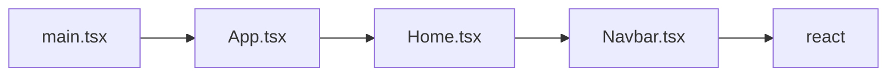
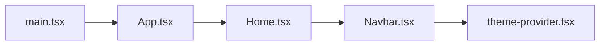
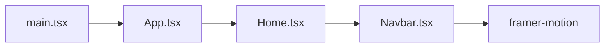
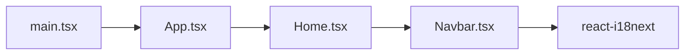
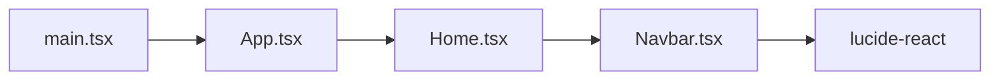

# Codebase Intelligence — MASTER.md
> Generated: 2026-06-13T07:22:41.758Z
> Project root: C:\Users\PavelKalugin\.sba\sba-security-landing
> Files: 106 | Edges: 402 | High-risk: 0 | Dead: 44 | Gaps filled: 0

## Quick stats

| Metric | Value |
|--------|-------|
| Files mapped | 106 |
| Total edges | 402 |
| Summaries | 106 |
| High-risk files (>60) | 0 |
| Dead files | 44 |
| Circular dependencies | 0 |
| God files | 5 |
| Coverage gaps | 0 |
| Gaps filled (subagents) | 0 |
| Danger zones | 13 |

## Table of contents

1. [Primary application flows](#primary-application-flows)
2. [Architecture overview](#architecture-overview)
3. [Entry points](#entry-points)
4. [Danger zones](#danger-zones)
5. [High-risk files](#high-risk-files)
6. [Dead code candidates](#dead-code-candidates)
7. [Coverage gaps](#coverage-gaps)
8. [Module map](#module-map)
9. [Tech stack](#tech-stack)
10. [Feature inventory](#feature-inventory)
12. [Legacy health report](#legacy-health-report)
13. [Output files](#output-files)

## Primary application flows

> Traced functional paths from entry points to core logic. Read these to understand the execution lifecycle.

### 🏁 src\main.tsx
Execution starts in `src\main.tsx` and flows through 3 intermediate layers to reach `react`.

### 🏁 src\main.tsx
Execution starts in `src\main.tsx` and flows through 3 intermediate layers to reach `src\components\theme-provider.tsx`.

### 🏁 src\main.tsx
Execution starts in `src\main.tsx` and flows through 3 intermediate layers to reach `framer-motion`.

### 🏁 src\main.tsx
Execution starts in `src\main.tsx` and flows through 3 intermediate layers to reach `react-i18next`.

### 🏁 src\main.tsx
Execution starts in `src\main.tsx` and flows through 3 intermediate layers to reach `lucide-react`.

## Architecture overview

106 files across typescript (74 files), python (26 files), java (3 files), swift (3 files). 402 dependency edges tracked. 23 high-value modules (entry points or widely imported). 0 files with risk score above 60.

### Language breakdown

| Language | Files | % |
|----------|-------|---|
| typescript | 74 | 70% |
| python | 26 | 25% |
| java | 3 | 3% |
| swift | 3 | 3% |

## Entry points

- **`clerk-react\src\main.tsx`** — Entry point that initialises the application.
  - Imports: react, react-dom/client, clerk-react\src\index.css, clerk-react\src\App.tsx
- **`src\main.tsx`** — Entry point that initialises the application.
  - Imports: react, react-dom/client, src\App.tsx, src\components\theme-provider.tsx, @clerk/clerk-react, @clerk/themes
- **`src\skills\ui-ux-pro-max-skill\.claude\skills\design\scripts\cip\generate.py`** — Entry point that initialises the application.
  - Imports: argparse
import json
import os
import sys
from pathlib import Path
from datetime import datetime

sys.path.insert, pathlib, datetime, core
- **`src\skills\ui-ux-pro-max-skill\.claude\skills\design\scripts\cip\render-html.py`** — Entry point that initialises the application.
  - Imports: argparse
import json
import os
import sys
import base64
from pathlib import Path
from datetime import datetime

sys.path.insert, pathlib, datetime, core
- **`src\skills\ui-ux-pro-max-skill\.claude\skills\design\scripts\cip\search.py`** — Entry point that initialises the application.
  - Imports: argparse
import json
import sys
from pathlib import Path

sys.path.insert, pathlib, core
- **`src\skills\ui-ux-pro-max-skill\.claude\skills\design\scripts\icon\generate.py`** — Entry point that initialises the application.
  - Imports: argparse
import json
import os
import re
import sys
import time
from pathlib import Path
from datetime import datetime

def load_env, pathlib, datetime
- **`src\skills\ui-ux-pro-max-skill\.claude\skills\design\scripts\logo\generate.py`** — Entry point that initialises the application.
  - Imports: argparse
import os
import sys
import time
from pathlib import Path
from datetime import datetime

def load_env, pathlib, datetime
- **`src\skills\ui-ux-pro-max-skill\.claude\skills\design\scripts\logo\search.py`** — Entry point that initialises the application.
  - Imports: argparse
from core import CSV_CONFIG, MAX_RESULTS, search, search_all

def format_output, core
- **`src\skills\ui-ux-pro-max-skill\.claude\skills\design-system\scripts\fetch-background.py`** — Entry point that initialises the application.
  - Imports: json
import csv
import re
import sys
from pathlib import Path

PROJECT_ROOT, pathlib
- **`src\skills\ui-ux-pro-max-skill\.claude\skills\design-system\scripts\generate-slide.py`** — Entry point that initialises the application.
  - Imports: argparse
import json
from pathlib import Path
from datetime import datetime

SCRIPT_DIR, pathlib, datetime
- **`src\skills\ui-ux-pro-max-skill\.claude\skills\design-system\scripts\html-token-validator.py`** — Entry point that initialises the application.
  - Imports: re
import json
import sys
from pathlib import Path
from typing import Dict, List, Tuple, Optional

PROJECT_ROOT, pathlib, typing
- **`src\skills\ui-ux-pro-max-skill\.claude\skills\design-system\scripts\search-slides.py`** — Entry point that initialises the application.
  - Imports: sys
import json
import argparse
from slide_search_core import, slide_search_core
- **`src\skills\ui-ux-pro-max-skill\.claude\skills\design-system\scripts\slide-token-validator.py`** — Entry point that initialises the application.
  - Imports: sys
import subprocess
from pathlib import Path

SCRIPT_DIR, pathlib
- **`src\skills\ui-ux-pro-max-skill\.claude\skills\ui-styling\scripts\shadcn_add.py`** — Entry point that initialises the application.
  - Imports: argparse
import json
import subprocess
import sys
from pathlib import Path
from typing import List, Optional

class ShadcnInstaller, pathlib, typing
- **`src\skills\ui-ux-pro-max-skill\.claude\skills\ui-styling\scripts\tailwind_config_gen.py`** — Entry point that initialises the application.
  - Imports: argparse
import json
import sys
from pathlib import Path
from typing import Any, Dict, List, Optional

class TailwindConfigGenerator, pathlib, typing
- **`src\skills\ui-ux-pro-max-skill\cli\assets\data\_sync_all.py`** — Entry point that initialises the application.
  - Imports: csv, os, json

BASE
- **`src\skills\ui-ux-pro-max-skill\cli\assets\scripts\design_system.py`** — Entry point that initialises the application.
  - Imports: csv
import json
import os
from datetime import datetime
from pathlib import Path
from core import search, DATA_DIR

REASONING_FILE, datetime, pathlib, core
- **`src\skills\ui-ux-pro-max-skill\cli\assets\scripts\search.py`** — Entry point that initialises the application.
  - Imports: argparse
import sys
import io
from core import CSV_CONFIG, AVAILABLE_STACKS, MAX_RESULTS, search, search_stack
from design_system import generate_design_system, persist_design_system

if sys.stdout.encoding and sys.stdout.encoding.lower
- **`src\skills\ui-ux-pro-max-skill\cli\src\index.ts`** — Entry point that initialises the application.
  - Imports: commander, fs, url, path, ./commands/init.js, ./commands/versions.js
- **`src\skills\ui-ux-pro-max-skill\cli\src\types\index.ts`** — Entry point that initialises the application.
- **`src\skills\ui-ux-pro-max-skill\src\ui-ux-pro-max\data\_sync_all.py`** — Entry point that initialises the application.
  - Imports: csv, os, json

BASE
- **`src\skills\ui-ux-pro-max-skill\src\ui-ux-pro-max\scripts\design_system.py`** — Entry point that initialises the application.
  - Imports: csv
import json
import os
from datetime import datetime
from pathlib import Path
from core import search, DATA_DIR

REASONING_FILE, datetime, pathlib, core
- **`src\skills\ui-ux-pro-max-skill\src\ui-ux-pro-max\scripts\search.py`** — Entry point that initialises the application.
  - Imports: argparse
import sys
import io
from core import CSV_CONFIG, AVAILABLE_STACKS, MAX_RESULTS, search, search_stack
from design_system import generate_design_system, persist_design_system

if sys.stdout.encoding and sys.stdout.encoding.lower

## Danger zones

> ⚠️ These files have high bug history or known workarounds. Always check with the contact before modifying.

### ⚠️ `src\App.tsx`
**Reason:** 4 bug fixes
**Contact:** vca.aktau@icloud.com

### ⚠️ `src\components\Cta.tsx`
**Reason:** 3 bug fixes
**Contact:** vca.aktau@icloud.com

### ⚠️ `src\components\Features.tsx`
**Reason:** 3 bug fixes
**Contact:** vca.aktau@icloud.com

### ⚠️ `src\components\Footer.tsx`
**Reason:** 6 bug fixes
**Contact:** vca.aktau@icloud.com

### ⚠️ `src\components\GlobalBackground.tsx`
**Reason:** 3 bug fixes
**Contact:** vca.aktau@icloud.com

### ⚠️ `src\components\Hero.tsx`
**Reason:** 6 bug fixes
**Contact:** vca.aktau@icloud.com

### ⚠️ `src\components\HowItWorks.tsx`
**Reason:** 3 bug fixes
**Contact:** vca.aktau@icloud.com

### ⚠️ `src\components\Navbar.tsx`
**Reason:** 3 bug fixes
**Contact:** vca.aktau@icloud.com

### ⚠️ `src\components\Projects.tsx`
**Reason:** 8 bug fixes
**Contact:** vca.aktau@icloud.com

### ⚠️ `src\components\Services.tsx`
**Reason:** 4 bug fixes
**Contact:** vca.aktau@icloud.com

### ⚠️ `src\components\Statistics.tsx`
**Reason:** 3 bug fixes
**Contact:** vca.aktau@icloud.com

### ⚠️ `src\components\Testimonials.tsx`
**Reason:** 7 bug fixes
**Contact:** vca.aktau@icloud.com

### ⚠️ `src\i18n.ts`
**Reason:** 3 bug fixes
**Contact:** vca.aktau@icloud.com

## High-risk files

> Files with risk score > 60. Read before modifying.

*No high-risk files detected.*

## Dead code candidates

> 44 files have no importers. They may be unused, entry points, or dynamically loaded.

| File | Language | Module risk | Classification |
|------|----------|-------------|----------------|
| `.eslintrc.cjs` | typescript | ⚪ unknown | — |
| `android\app\src\androidTest\java\com\getcapacitor\myapp\ExampleInstrumentedTest.java` | java | ⚪ unknown | — |
| `android\app\src\main\java\com\sba\aktau\MainActivity.java` | java | ⚪ unknown | — |
| `android\app\src\test\java\com\getcapacitor\myapp\ExampleUnitTest.java` | java | ⚪ unknown | — |
| `api\delete-project.ts` | typescript | ⚪ unknown | — |
| `api\get-all-projects.ts` | typescript | ⚪ unknown | — |
| `api\get-projects.ts` | typescript | ⚪ unknown | — |
| `api\projects.ts` | typescript | ⚪ unknown | — |
| `api\telegram.ts` | typescript | ⚪ unknown | — |
| `api\upload.ts` | typescript | ⚪ unknown | — |
| `api\users.ts` | typescript | ⚪ unknown | — |
| `ios\App\App\AppDelegate.swift` | swift | ⚪ unknown | — |
| `ios\App\CapApp-SPM\Package.swift` | swift | ⚪ unknown | — |
| `ios\App\CapApp-SPM\Sources\CapApp-SPM\CapApp-SPM.swift` | swift | ⚪ unknown | — |
| `src\components\mode-toggle.tsx` | typescript | ⚪ unknown | — |
| `src\components\ui\avatar.tsx` | typescript | ⚪ unknown | — |
| `src\components\ui\badge.tsx` | typescript | ⚪ unknown | — |
| `src\components\ui\card.tsx` | typescript | ⚪ unknown | — |
| `src\components\ui\dropdown-menu.tsx` | typescript | ⚪ unknown | — |
| `src\components\ui\input.tsx` | typescript | ⚪ unknown | — |

> ...and 24 more. Run `wednesday-skills dead` for full list.

## Coverage gaps

> No gaps detected. Graph coverage is complete.

## Module map

> One row per directory. For per-file detail: `wednesday-skills blast <file>` or `wednesday-skills chat "what does X do"`.

| Directory | Files | Avg risk | Debt | Type | Purpose |
|-----------|-------|----------|------|------|---------|
| `(root)` | 6 | 🟢 8 | — | — | — |
| `android\app\src\androidTest\java\com\getcapacitor\myapp` | 1 | 🟢 8 | — | — | — |
| `android\app\src\main\java\com\sba\aktau` | 1 | 🟢 8 | — | — | — |
| `android\app\src\test\java\com\getcapacitor\myapp` | 1 | 🟢 8 | — | — | — |
| `api` | 7 | 🟢 8 | — | — | — |
| `clerk-react` | 2 | 🟢 8 | — | — | — |
| `clerk-react\src` | 2 | 🟢 9 | — | — | — |
| `ios\App\App` | 1 | 🟢 8 | — | — | — |
| `ios\App\CapApp-SPM` | 1 | 🟢 8 | — | — | — |
| `ios\App\CapApp-SPM\Sources\CapApp-SPM` | 1 | 🟢 8 | — | — | — |
| `src` | 4 | 🟢 9 | — | — | — |
| `src\components` | 20 | 🟡 33 | — | — | — |
| `src\components\ui` | 10 | 🟢 16 | — | — | — |
| `src\db` | 2 | 🟡 40 | — | — | — |
| `src\lib` | 1 | 🟡 43 | — | — | — |
| `src\pages` | 2 | 🟡 34 | — | — | — |
| `src\skills\ui-ux-pro-max-skill\.claude\skills\brand\scripts` | 4 | 🟢 8 | — | — | — |
| `src\skills\ui-ux-pro-max-skill\.claude\skills\design-system\scripts` | 9 | 🟢 8 | — | — | — |
| `src\skills\ui-ux-pro-max-skill\.claude\skills\design\scripts\cip` | 4 | 🟢 8 | — | — | — |
| `src\skills\ui-ux-pro-max-skill\.claude\skills\design\scripts\icon` | 1 | 🟢 8 | — | — | — |
| `src\skills\ui-ux-pro-max-skill\.claude\skills\design\scripts\logo` | 3 | 🟢 8 | — | — | — |
| `src\skills\ui-ux-pro-max-skill\.claude\skills\ui-styling\scripts` | 2 | 🟢 8 | — | — | — |
| `src\skills\ui-ux-pro-max-skill\.claude\skills\ui-styling\scripts\tests` | 2 | 🟢 8 | — | — | — |
| `src\skills\ui-ux-pro-max-skill\cli\assets\data` | 1 | 🟢 8 | — | — | — |
| `src\skills\ui-ux-pro-max-skill\cli\assets\scripts` | 3 | 🟢 8 | — | — | — |
| `src\skills\ui-ux-pro-max-skill\cli\src` | 1 | 🟢 8 | — | — | — |
| `src\skills\ui-ux-pro-max-skill\cli\src\commands` | 4 | 🟢 8 | — | — | — |
| `src\skills\ui-ux-pro-max-skill\cli\src\types` | 1 | 🟢 8 | — | — | — |
| `src\skills\ui-ux-pro-max-skill\cli\src\utils` | 5 | 🟢 8 | — | — | — |
| `src\skills\ui-ux-pro-max-skill\src\ui-ux-pro-max\data` | 1 | 🟢 8 | — | — | — |
| `src\skills\ui-ux-pro-max-skill\src\ui-ux-pro-max\scripts` | 3 | 🟢 8 | — | — | — |

## Tech stack

| Dimension | Details |
|-----------|---------|
| Platform | iOS |
| Languages | Typescript, Python, Java, Swift |
| Frameworks | react, UIKit |
| Key Libraries | react, tailwindcss |

## Feature inventory

> Inferred business domains from codebase structure.

- **Home / Dashboard:** `mainactivity`, `main`, `dashboard`, `home`
- **API / Networking:** `delete-project`, `get-all-projects`, `get-projects`, `projects`, `telegram`, `upload`, `users`
- **Media:** `upload`
- **User / Profile:** `users`, `avatar`
- **Notifications:** `badge`
- **Storage / Database:** `index`, `schema`
- **Authentication:** `sync-brand-to-tokens`, `embed-tokens`, `generate-tokens`, `html-token-validator`, `slide-token-validator`, `validate-tokens`
- **Search:** `search`, `search-slides`, `slide_search_core`

## Legacy health report

### God files

> Files doing too many things. Candidates for decomposition.

| File | Exports | Concerns |
|------|---------|----------|
| `src\skills\ui-ux-pro-max-skill\.claude\skills\design-system\scripts\generate-slide.py` | 16 | auth |
| `src\skills\ui-ux-pro-max-skill\.claude\skills\design-system\scripts\html-token-validator.py` | 19 | auth |
| `src\skills\ui-ux-pro-max-skill\.claude\skills\design-system\scripts\slide_search_core.py` | 19 | mixed |
| `src\skills\ui-ux-pro-max-skill\cli\assets\data\_sync_all.py` | 16 | mixed |
| `src\skills\ui-ux-pro-max-skill\src\ui-ux-pro-max\data\_sync_all.py` | 16 | mixed |

### Circular dependencies
*None detected.*

### Tech debt (ranked)

| File | Bug fixes | Age | Coverage | Priority |
|------|-----------|-----|----------|----------|
| `src\App.tsx` | 4 | 0.3yr | ? | **High** |
| `src\components\Cta.tsx` | 3 | 0.3yr | ? | **High** |
| `src\components\Features.tsx` | 3 | 0.3yr | ? | **High** |
| `src\components\GlobalBackground.tsx` | 3 | 0.3yr | ? | **High** |
| `src\components\HowItWorks.tsx` | 3 | 0.3yr | ? | **High** |
| `src\components\Navbar.tsx` | 3 | 0.3yr | ? | **High** |
| `src\components\Services.tsx` | 4 | 0.3yr | ? | **High** |
| `src\components\Statistics.tsx` | 3 | 0.3yr | ? | **High** |
| `src\i18n.ts` | 3 | 0.3yr | ? | **High** |
| `api\telegram.ts` | 2 | 0.3yr | ? | **Medium** |
| `src\components\Calculator.tsx` | 2 | 0.3yr | ? | **Medium** |
| `src\components\Footer.tsx` | 6 | 0.3yr | ? | **Critical** |
| `src\components\Hero.tsx` | 6 | 0.3yr | ? | **Critical** |
| `src\components\Projects.tsx` | 8 | 0.3yr | ? | **Critical** |
| `src\components\Testimonials.tsx` | 7 | 0.3yr | ? | **Critical** |

## Annotation coverage

| Category | Found | Annotated | Coverage |
|----------|-------|-----------|---------|
| Dynamic requires | 0 | 0 | 100% |
| Global injections | 0 | 0 | 100% |
| Event emitters | 0 | 0 | 0% |

> Boy scout rule: whoever touches a file adds annotations for that file.

## Output files

| File | Description |
|------|-------------|
| `.wednesday/codebase/dep-graph.json` | Full dependency graph |
| `.wednesday/codebase/summaries.json` | Module summaries |
| `.wednesday/codebase/MASTER.md` | This file — architecture overview + module map |
| `.wednesday/codebase/analysis/blast-radius.json` | Top 50 files by blast radius |
| `.wednesday/codebase/analysis/safety-scores.json` | Risk scores (0–100) per file |
| `.wednesday/codebase/analysis/dead-code.json` | Dead files + circular deps |
| `.wednesday/codebase/analysis/api-surface.json` | Public contracts per file |
| `.wednesday/codebase/analysis/conflicts.json` | Dependency conflicts |
| `.wednesday/codebase/analysis/comments.json` | Comment intelligence — TODOs, ideas, tech debt |
| `.wednesday/codebase/analysis/comments-raw.md` | Pre-LLM comment collection |

---
*Generated by wednesday-skills map — graph analysis only, no raw source read*